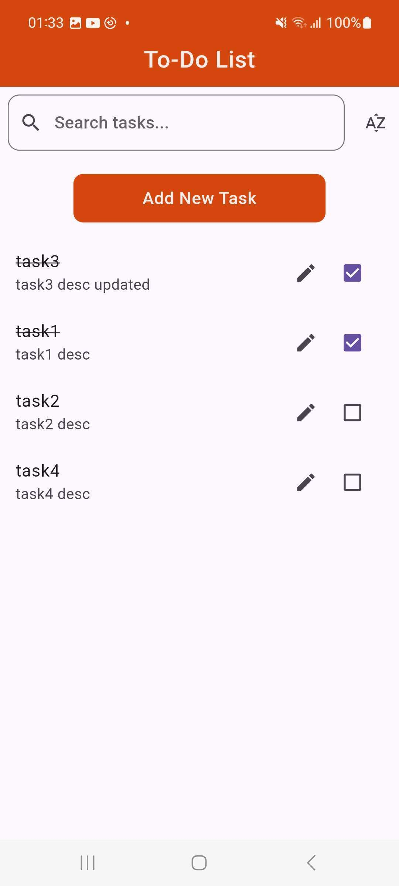

# To-Do Application

This is a simple To-Do application built using the Flutter framework. It allows users to create, update, search, and filter tasks, along with persistent storage using `SharedPreferences` to save tasks locally.

## Documentation

This application helps users manage their tasks efficiently. Users can add new tasks, mark them as completed, update, or delete them. Additionally, the app features a search bar to filter tasks by name and sort tasks based on completion status.

## Run Locally

Clone the project

```bash
git clone https://github.com/basitansari899/todo-app
```
Go to the project directory

```bash
  cd Todo-App
```

Install dependencies

```bash
  flutter pub get
```

run main.dart file 

```bash
  flutter run
```

## Screenshots

<p float="left">
    
    
    
    
    
    
    
    

</p>